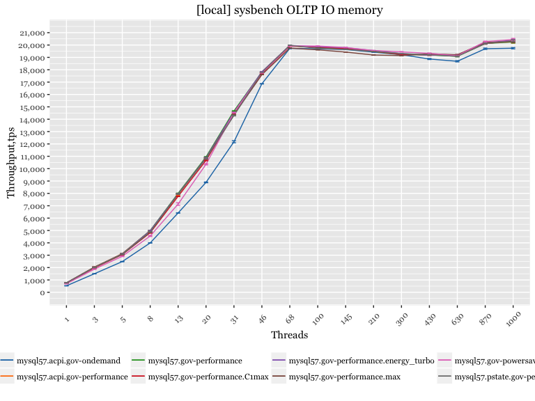

Power and governors
-------------------

|  threads|  mysql57.acpi.gov-ondemand|  mysql57.acpi.gov-performance|  mysql57.gov-performance|  mysql57.gov-performance.C1max|  mysql57.gov-performance.energy\_turbo|  mysql57.gov-performance.max|  mysql57.gov-powersave|  mysql57.pstate.gov-performance.BIOSdefault|
|--------:|--------------------------:|-----------------------------:|------------------------:|------------------------------:|--------------------------------------:|----------------------------:|----------------------:|-------------------------------------------:|
|        1|                     525.61|                        760.97|                   746.55|                         737.86|                                 764.09|                       761.02|                 689.97|                                      760.08|
|        3|                    1499.30|                       2036.67|                  2017.33|                        1969.25|                                2022.15|                      2031.64|                1870.51|                                     2015.69|
|        5|                    2484.77|                       3130.89|                  3102.58|                        3055.31|                                3108.08|                      3067.09|                2911.39|                                     3106.09|
|        8|                    3994.67|                       4982.78|                  4992.46|                        4820.34|                                4981.56|                      4866.51|                4554.74|                                     4905.01|
|       13|                    6417.24|                       7903.53|                  8005.86|                        7762.89|                                7962.60|                      7937.09|                7136.87|                                     7946.71|
|       20|                    8891.76|                      10888.07|                 10950.09|                       10668.28|                               10878.67|                     10818.64|               10355.98|                                    10812.54|
|       31|                   12176.06|                      14569.73|                 14669.01|                       14390.89|                               14560.15|                     14359.67|               14530.72|                                    14299.17|
|       46|                   16865.00|                      17752.52|                 17813.42|                       17692.20|                               17841.25|                     17603.67|               17743.61|                                    17800.24|
|       68|                   19730.02|                      19921.97|                 19952.36|                       19904.09|                               19967.11|                     19749.10|               19921.95|                                    19979.63|
|      100|                   19688.29|                      19853.01|                 19796.49|                       19836.82|                               19867.63|                     19613.06|               19921.31|                                    19723.24|
|      145|                   19636.90|                      19733.73|                 19717.10|                       19703.55|                               19782.17|                     19431.00|               19798.63|                                    19648.82|
|      210|                   19428.16|                      19476.86|                 19479.06|                       19494.70|                               19546.05|                     19191.91|               19556.08|                                    19488.29|
|      300|                   19218.45|                      19290.22|                 19230.56|                       19235.78|                               19302.66|                     19146.18|               19450.26|                                    19312.61|
|      430|                   18868.34|                      19172.71|                 19198.07|                       19218.79|                               19171.25|                     19300.79|               19324.82|                                    19205.74|
|      630|                   18685.86|                      19193.36|                 19089.49|                       19146.81|                               19189.58|                     19209.26|               19139.08|                                    19085.61|
|      870|                   19699.73|                      20196.26|                 20120.00|                       20121.89|                               20169.22|                     20206.88|               20276.87|                                    20116.05|
|     1000|                   19742.82|                      20255.83|                 20253.72|                       20315.77|                               20392.39|                     20296.75|               20446.88|                                    20353.65|

